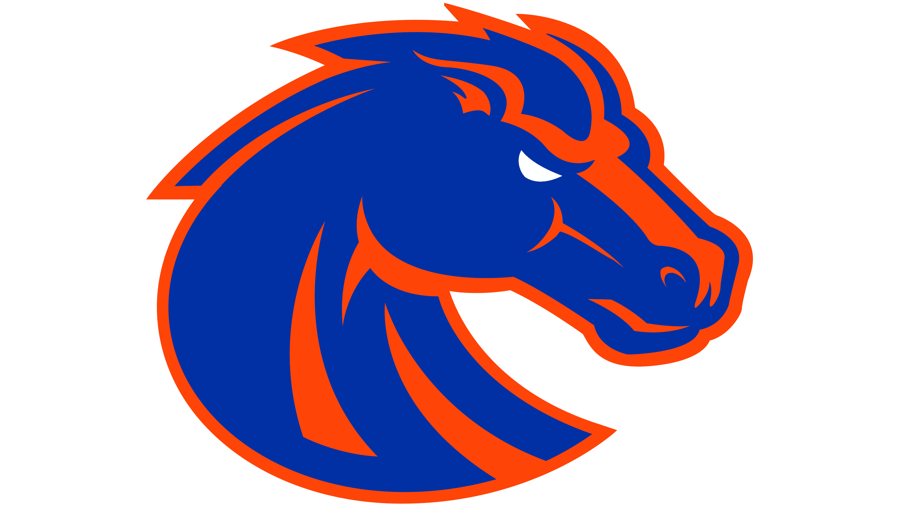

I am currently a mechanical engineering student at Boise State University.

As for coding I am primarily interested in the fusion of computer science with engineering which entails:

- Artificial Intelligence
- Search algorithms
- Math both numerical and analytical
- Robotics
- Control problems
- etc.

### Languages
- Java
- Python
- HTML/CSS/javascript
- C (learning) 

Here is a [link](https://calebhottesportfolio.netlify.app/) to my personal website/online resume/portfolio which has more information.

### Go Broncos

